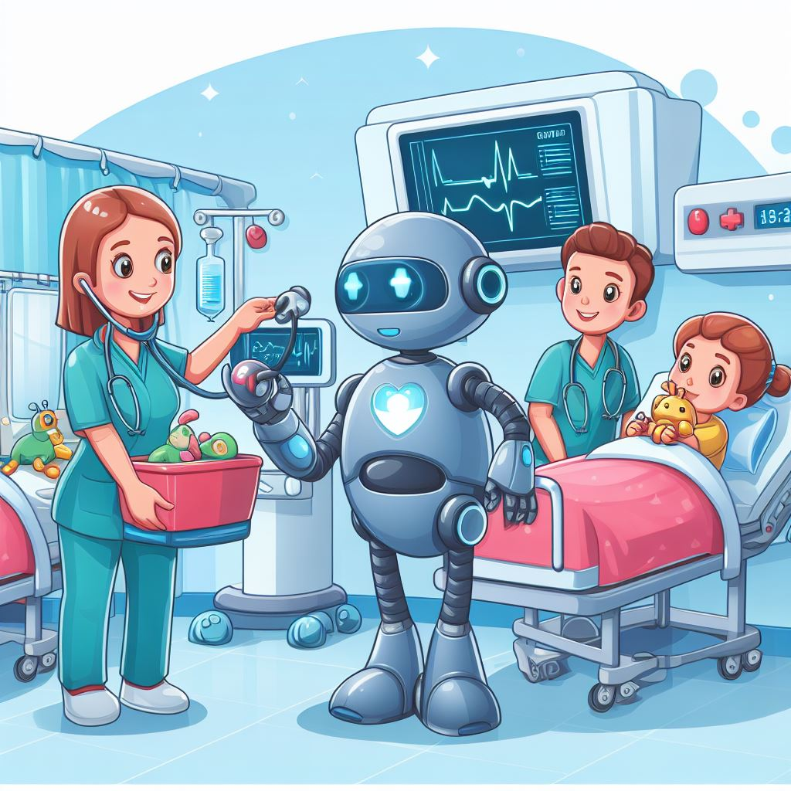

# Nationwide Children's Hospital  : AI Research and Recommendations

## Table of contents
- [Overview and Origin](#overview-and-origin)
- [Business Activities](#business-activities)
- [Landscape and Results](#landscape)
- [Recommendations](#recommendations)
- [Bibliography](#bibliography)

## Overview and Origin 

Nationwide Children’s Hospital, which is affiliated with the Ohio State University College of Medicine, was originally opened in 1892 by a group of 12 women from a sewing circle who wanted to create a hospital that would give the best healthcare to children despite their family's ability (or inability) to pay for the care. It has stayed true to this principle to this day, giving affordable healthcare to families by means of philanthropic and government funding, as well as the acquisition of research grants. The Hospital obtained its modern name when it was given a $50 million grant from the Nationwide foundation, part of Nationwide Insurance company. Today, Nationwide Childrens remains one of the largest hospitals serving children in the nation. (Nationwidechildrens.org, library.osu.edu, Wikipedia.org) 

## Business Activities 

Being a children’s hospital, it goes without saying that NC’s priority will always be to care for children in need of medical attention; however, the business has grown a lot since its inception and can afford very much to engage in meaningful research to benefit the field of medicine as a whole, and to improve the customer experience in general. The customers of the hospital, after all, are not only the children, but also the caretakers of the children who will want to have as seamless an experience as possible in dealing with the hospital administration and financial systems. Moreover, Doctors, to give the best treatment available, will rely upon technologies created by AI researchers to help diagnose patients and to make their lives easier.  (Nationwidechildrens.org) 

As the field of medicine is not a competitive industry in the same sense as are profit-driven enterprises, it is hard to point to any singular piece of technology that NC uses which gives it an edge over other hospitals; if there were something easy to implement that could save lives, a Hospital would not jealously guard knowledge of that technology but make sure that other hospitals have a chance to learn from and implement it as well. That said, NC is a very well-funded hospital and within the top 10 Children’s Hospitals within the United States which allows NC to probably adopt more solutions, in the aggregate, than its competitors do on account of the availability of resources. (Nationwidechildrens.org, Sirrianni, J.) 

The AI space at NC is primarily focused in doing research in the NLP space so that the process of writing notes, and that of other administrative procedures, may be expedited to free up time among the hospital staff. While the note taking that the doctors at NC are doing might not necessarily require AI, as much of it is quite heavily templated, AI technology which listens to phone calls and summarizes, categorizes, and converts to text the information given in the message is being utilized and continuously developed. Another application for AI which is currently being developed is that of image recognition technology, which is to be used as a means of helping doctors diagnose their patients. Of course, there would be a lot of other applications for machine learning as a means of diagnosing patient illnesses, however, it is difficult for the RND team to get buy in from any such technology as the usefulness of standard statistical methods such as linear regression remain a lot more useful to many physicians because they are not as “black-box” as Machine learning models tend to be; this makes a future of Robots helping in the diagnosis still a dream far away from any immediate grasp. (Sirrianni, J.) 

## Landscape and Results 

AI in healthcare, like most industries, has developed a lot in the past 5 to 10 years. The most recent trend is that of natural language processing since BERT came out in 2018, and most of the recent efforts have been focused on that across industries. Because of the computational intensity of models which are capable of such efforts, there has also been a general rise in cloud computing among hospitals as most hospitals do not have the resources to spare on their own proprietary array of high-performance compute servers running locally. (Sirrianni, J.) 

Healthcare, being what it is, is a field which can take advantage of local monopoly effects; people do not usually travel very far when they are in need of healthcare to save a few dollars, and so one cannot compare competition between hospitals to that of businesses which are competing in the technology sector, for example. Competition between hospitals is largely collaborative, similar to how universities will compete with one another. That allows Hospitals to share a lot of knowledge with each other while still pursuing excellence in research. (Sirrianni, J.) 

As such, we can identify the closest competitors and collaborators of NC as being those other hospitals for children which have obtained laurels on account of their contributions which are in relatively proximity. Hospitals can determine their success based upon how few returning discharges they have, overall customer satisfaction, and the amount of research grant money which they bring in; NC is rated as the 9th best children’s hospital in the United States which puts it into pretty hot competition with the nearby Cincinnati Children’s Hospital which is ranked 3rd. Another fierce competitor in local proximity is the Mayo Clinic, also in Columbus but not a children’s hospital, which has an agreement with google to research new technologies in the AI field. Nationwide is therefore doing well but can still catch up to other hospitals near it through collaborative projects. (Sirrianni, J.) 

## Recommendations 

One of the areas in which this hospital still lags is the development of a “chat gpt for physician notes”. A lot of hospitals would like to have their own proprietary software for such things, and with no large adoption of anything like sucki.ai anyway, this hospital is still lagging at saving the value time of their practicing physicians. The main reason why these things take so long in the healthcare sector is because the motto of “move fast and break things” does not work well for the healthcare sector. I would advise development in this sector as the time it takes physicians to fill out paperwork often results in work being taken home and consequently burnout. (Sirriani, J.) 

  > "In the Healthcare sector, we do not move fast and break things; that is the exact opposite thing of what we're trying to do here." — _Joe Sirrianni_
 
Another problem which the company faces is that of AI imaging technology. Hospital data, on account of its geographic limitations, is not necessarily diverse enough to successfully provide a model which reliably works everywhere and across all different demographics, which could become a very controversial issue. This problem could theoretically be solved through enough collaboration with other hospitals sharing data to solve a problem. While such collaborations, however, are not unheard of, merging disparate datasets with different formats without looking at the information (thus breaking healthcare privacy requirements) remains a serious challenge. (Sirrianni, J.) 

My idea for potentially solving this problem would be to work on finding a way to make a unified dataset between hospital data with the help of AI. An AI could perhaps be trained on the datasets of different hospitals in order to come up with a way to expediently scrape data without the need for human supervision in the process, thus protecting privacy of the patients who would have their data examined in this way. With such a solution, hospitals would be free to develop their own AI and machine learning solutions on the basis of data from the whole US and, one would hope, eventually the world.  

The biggest challenge in developing such a solution, however, is that it would be requisite to have a human view upon the data throughout the course of training. Even an “unsupervised” model requires supervision, at the end of the day, to ensure that model output is not misleading, and this is doubly important, of course, within the healthcare industry. The way to do it might be to ask a few people if they would be willing to volunteer their healthcare information for this process, and perhaps even to pay them for it, though this might be likely to attract more desperate patients to give their data, potentially skewing the data upon which the model is trained. An alternative would be to ask physicians to sit down and to “make up” some patient records which they would likely see; in this case, their intuition would guide them toward making decisions about what ailments and symptoms they typically expect to see together, however, it would be questionable exactly what information the model even provides us with at that point as the data is fictional and reflects the knowledge and biases already prevalent within the medical field at that point, thus perhaps not even leading to any genuine contribution.  

Personally, I still think the volunteer records solution is the best, but arriving at an unbiased sample would be the primary challenge, and it likely would take a lot of time and resources to complete such a project. If it is possible to get good data which can be trusted, and which is volunteered, it wouldn’t even matter so much if we use a supervised or unsupervised approach, at least in conceptual terms.  

## Bibliography 

* Sirrianni, J. (2023, October 26). Personal interview [Data Scientist at Nationwide Children’s Hospital].
* Nationwide Children’s Hospital. (n.d.). History and Milestones. Retrieved October 27, 2023, from https://www.nationwidechildrens.org/about-us/our-story/history-and-milestones
* Nationwide Children’s Hospital. (n.d.). About Us. Retrieved October 27, 2023, from https://www.nationwidechildrens.org/about-us
* Rodgers, J. (2016, September 15). Nationwide Children’s Hospital. Retrieved October 27, 2023, from https://library.osu.edu/site/mhcb/2016/09/15/nationwide-childrens-hospital/
* Nationwide Children’s Hospital. (2023, October 27). In Wikipedia. Retrieved October 27, 2023, from https://en.wikipedia.org/wiki/Nationwide_Children%27s_Hospital
* Nationwide Children’s Hospital. (n.d.). Our Story. Retrieved October 27, 2023, from https://www.nationwidechildrens.org/about-us/our-story
* Nationwide Children’s Hospital. (n.d.). Fast Facts. Retrieved October 27, 2023, from https://www.nationwidechildrens.org/about-us/our-story/fast-facts
* Nationwide Children’s Hospital. (2021, June 16). Strategic Plan: Transforming Health Outcomes for Children Locally and Around the World. Retrieved October 27, 2023, from https://www.nationwidechildrens.org/newsroom/news-releases/2021/06/strategic-plan
* ABC6 News Staff. (2021, June 16). Nationwide Children’s Hospital announces expansion. ABC6OnYourSide.com. Retrieved October 27, 2023, from https://abc6onyourside.com/news/local/nationwide-childrens-hospital-announces-expansion-6-16-2021
* Nationwide Children’s Hospital Research Institute IT Research and Innovation Grant Funding | Crunchbase Company Profile & Funding. (n.d.). Retrieved October 27, 2023, from https://www.crunchbase.com/organization/nationwide-childrens-hospital
* Nationwide Insurance Foundation | Giving | NCH | Nationwide Children’s Hospital Foundation | Columbus Ohio (n.d.). Retrieved October 27, 2023, from https://www.nationwide.com/personal/about-us/giving/nch/
* Weiker, J., & Schladen, M. (2021, June 16). Nationwide Children’s to spend billions on new hospital buildings, programs. The Columbus Dispatch. Retrieved October 27, 2023, from https://www.dispatch.com/story/news/2021/06/16/nationwide-childrens-spend-billions-new-hospital-buildings-programs/7687094002/
* Fig. 1. “Nationwide Children’s Hospital futuristic vision watercolor.” Generated by Bing Image Creator, version 1.0, 27 Oct. 2023.
* Fig. 2. “Robots Caring for Patients in Nationwide Children’s Hospital: Friendly Cartoonish Art.” Generated by Bing Image Creator, version 1.0, 27 Oct. 2023.